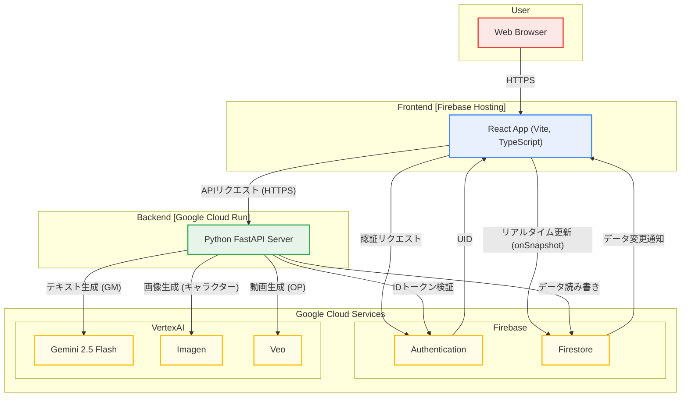

```mermaid
graph TD
    subgraph User
        A[Web Browser]
    end

    subgraph "Frontend [Firebase Hosting]"
        B["React App (Vite, TypeScript)"]
    end

    subgraph "Backend [Google Cloud Run]"
        C[Python FastAPI Server]
    end

    subgraph "Google Cloud Services"
        subgraph Firebase
            D[Authentication]
            E[Firestore]
        end
        subgraph VertexAI
            F[Gemini 2.5 Flash]
            G[Imagen]
            H[Veo]
        end
    end

    %% --- Interactions ---

    A -- HTTPS --> B;

    B -- 認証リクエスト --> D;
    D -- UID --> B;

    B -- リアルタイム更新 (onSnapshot) --> E;
    E -- データ変更通知 --> B;

    B -- APIリクエスト (HTTPS) --> C;

    C -- IDトークン検証 --> D;
    C -- データ読み書き --> E;
    C -- テキスト生成 (GM) --> F;
    C -- 画像生成 (キャラクター) --> G;
    C -- 動画生成 (OP) --> H;

    %% --- Styling ---
    classDef frontend fill:#E8F0FE,stroke:#4285F4,stroke-width:2px;
    classDef backend fill:#E6F4EA,stroke:#34A853,stroke-width:2px;
    classDef gcp fill:#FFFDE7,stroke:#FBBC04,stroke-width:2px;
    classDef user fill:#FCE8E6,stroke:#EA4335,stroke-width:2px;

    class A user;
    class B frontend;
    class C backend;
    class D,E,F,G,H gcp;
```